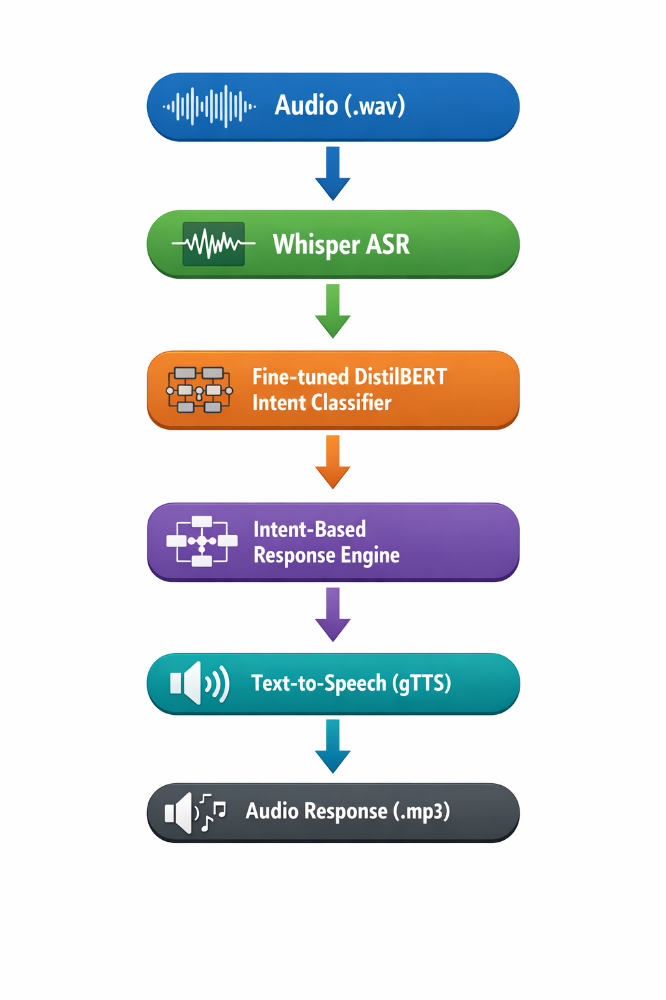

#  AI Voice Bot – End-to-End Transformer-Based Customer Support System

An end-to-end AI-powered Voice Bot system that processes user audio input and returns a synthesized voice response using:

Speech-to-Text → Intent Classification → Context-Aware Response → Text-to-Speech

Built with FastAPI, HuggingFace Transformers, Whisper ASR, and PyTorch.

##  Project Overview

This project implements a production-style AI Voice Bot capable of:

- Converting speech to text (ASR)
- Classifying user intent using a fine-tuned transformer model
- Generating structured, context-aware responses
- Converting responses back to speech
- Exposing all functionality via REST API endpoints

The system is modular, scalable, and API-ready.

##  System Architecture

## 🧠 NLP Model Details

### Model Used
- **DistilBERT (distilbert-base-uncased)**
- Fine-tuned for multi-class intent classification

### Intent Classes (10)
- refund_request
- product_info
- complaint
- account_update
- order_status
- subscription_issue
- cancel_order
- technical_support
- delivery_delay
- payment_problem

### Training Configuration
- Epochs: 5
- Optimizer: AdamW
- Learning Rate: 2e-5
- Batch Size: 8
- Loss Function: Cross-Entropy
- Framework: HuggingFace Transformers + PyTorch

### Model Performance
- Accuracy: ~95%
- Macro F1-score: ~0.94
- Precision/Recall balanced across classes
- Confusion matrix available in `/evaluation`

##  Speech Recognition

- Model: Whisper (lightweight configuration)
- Converts uploaded `.wav` files into transcribed text
- Integrated into pipeline via modular ASR component

##  Response Generation Strategy

Instead of unconstrained LLM output, a structured intent-aware response system is implemented to:

- Prevent hallucination
- Ensure consistent customer tone
- Maintain production-level stability
- Improve reliability

##  Text-to-Speech

- Library: gTTS
- Converts generated responses into downloadable `.mp3` files
- Integrated into unified `/voicebot` endpoint

##  REST API Endpoints

| Endpoint | Method | Description |
|----------|--------|-------------|
| `/transcribe` | POST | Convert audio to text |
| `/predict-intent` | POST | Predict intent from text |
| `/generate-response` | POST | Generate response from intent |
| `/synthesize` | POST | Convert text to audio |
| `/voicebot` | POST | Full pipeline: Audio → Audio |

Swagger Documentation:
http://127.0.0.1:8000/docs

##  Installation & Setup

### 1 Clone repository
git clone <repo-link>
cd AI_voicebot

### 2 Create Virtual Environment
python -m venv venv
venv\Scripts\activate

## 3️ Install Dependencies
pip install -r requirements.txt

### Run Application

uvicorn main:app --reload

### API available at:

http://127.0.0.1:8000

### Swagger UI:

http://127.0.0.1:8000/docs

### Project Structure 

AI_voicebot/
│
├── main.py
├── requirements.txt
├── README.md
├── .gitignore
│
├── app/
│   ├── asr/
│   ├── nlp/
│   ├── responses/
│   ├── tts/
│   └── config/
│
├── models/
│   └── intent_model/
│
├── evaluation/
│   └── confusion_matrix.png
│
├── generate_dataset.py
├── train_intent_model.py

