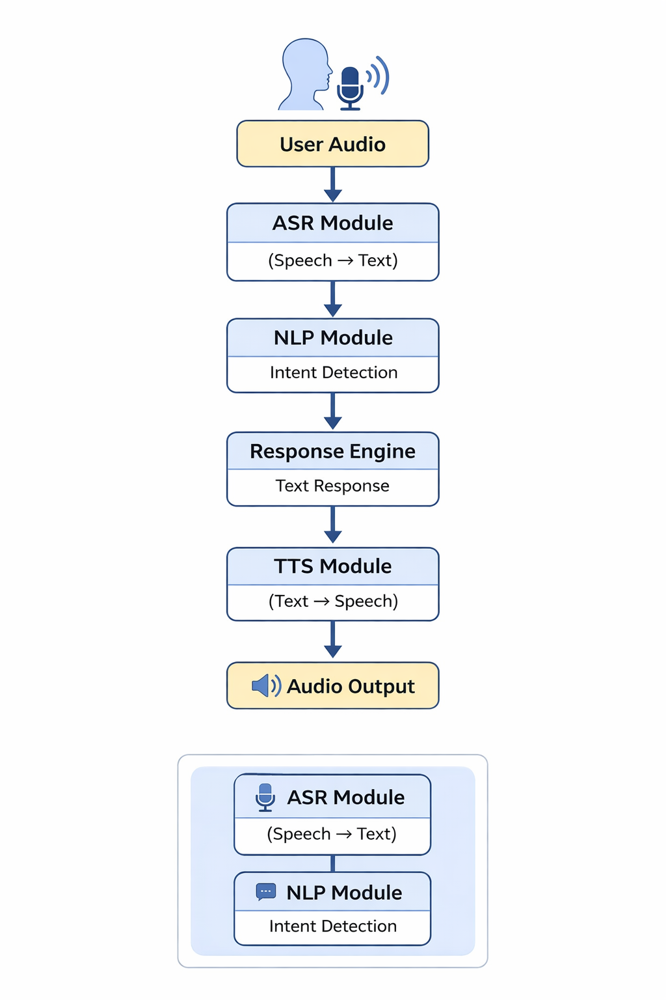
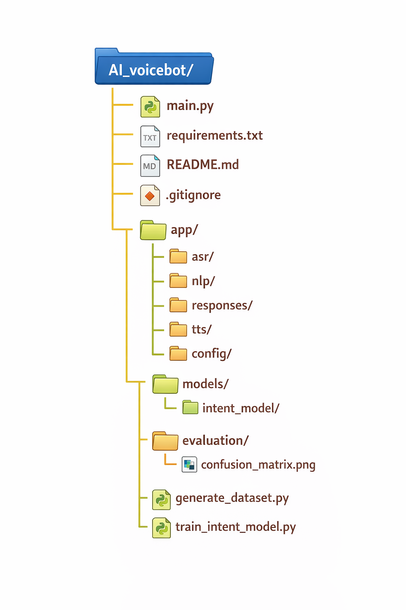

### AI VoiceBot – End-to-End Audio Conversational System

An end-to-end AI VoiceBot system that converts audio → text → intent → response → audio, optimized for low latency and modular architecture.

### Overview

This project implements a modular AI VoiceBot system with the following pipeline:

User Audio → ASR → Intent Classification → Response Generation → TTS → Audio Output

The system supports:

Individual modular endpoints

A unified /voicebot endpoint (audio → audio)

Optimized inference (< 3–5 seconds latency)

Proper memory handling

Clean architecture without scattered hard-coded responses

### Architecture Diagram

### Module Breakdown

| Module          | Description                      |
| --------------- | -------------------------------- |
| ASR             | Converts speech to text          |
| NLP             | Predicts user intent             |
| Response Engine | Generates contextual response    |
| TTS             | Converts response text to speech |
| Config          | Stores settings and model paths  |
| Models          | Contains trained intent model    |

### Project Structure

### API Endpoints

### 1️ Transcribe
POST /transcribe

Input: Audio file
Output: Transcribed text

### 2️ Predict Intent
POST /predict-intent

Input: Text
Output:

{
  "intent": "greeting",
  "confidence": 0.94
}

### 3️ Generate Response
POST /generate-response

Input: Intent + Text
Output: Response text

### 4️ Synthesize
POST /synthesize

Input: Text
Output: Audio file

### 5️ Unified VoiceBot Endpoint (Preferred)
POST /voicebot

Input: Audio
Output: Audio Response

This endpoint handles the complete pipeline internally.

 ### Model Choices & Justification

###  ASR Model

Lightweight speech-to-text model

Optimized for low latency

Suitable for local inference

### Intent Classification

Trained ML model (e.g., Logistic Regression / Neural Network)

Fast inference

Stored in /models/intent_model/

Evaluated using accuracy & confusion matrix

### Response Generation

Template-based structured responses

Centralized response mapping (no scattered hardcoding)

### TTS

Lightweight speech synthesis

Optimized for fast audio output generation

### Setup Instructions

### 1️ Clone Repository
git clone <repo_link>
cd AI_voicebot

### 2️ Create Virtual Environment
python -m venv venv
source venv/bin/activate   # Linux/Mac
venv\Scripts\activate      # Windows

### 3️ Install Dependencies
pip install -r requirements.txt

### 4️ Run Application
python main.py

### Server runs at:

http://localhost:8000/docs

### Evaluation Metrics

### Intent Classification

Accuracy

Precision

Recall

F1 Score

Confusion Matrix (available in /evaluation/)

### Performance

End-to-End Latency: Under 3–5 seconds

Optimized inference

Efficient memory usage

### API Usage Examples

### Using curl (Unified Endpoint)

curl -X POST "http://localhost:8000/voicebot" \
-F "file=@sample_audio.wav" \
--output response.wav

### Sample Test Audio Files

Included in submission:

greeting.wav

query.wav

fallback.wav

### Demo

<audio controls src="voicebot_response.mp3" title="Title"></audio>

###  Design Principles Followed

 Modular architecture

 No scattered hard-coded responses

 Centralized configuration

 Optimized inference

 Clean readable code

 Proper memory management

### Future Improvements

Multi-language support

Streaming audio support

Transformer-based intent detection

Deployment using Docker

Cloud API hosting
